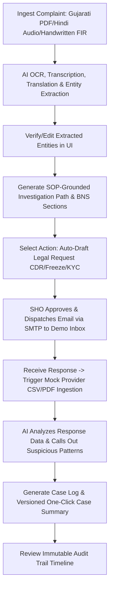

# Crime OS AI — Intelligence-Led Police Investigation Platform

Crime OS AI is an agentic AI platform designed for intelligence-led police investigations covering both cyber and conventional crime. The platform assists law enforcement officers across the entire case lifecycle: from multimodal, multilingual complaint ingestion to SOP-grounded investigation path suggestions, automated legal request drafting, response analytics, and auto-generated case summaries.

Developed for the **ERH26 Hackathon (Problem Statement: ERH26_PS_10)**, the platform is optimized to showcase an end-to-end investigation workflow while strictly maintaining legal grounding, audit transparency, and developer-friendly local execution.

---

## 📖 Table of Contents
1. [Key Features](#-key-features)
2. [Problem Statement Mapping](#-problem-statement-mapping)
3. [The Golden Path Demo Flow](#-the-golden-path-demo-flow)
4. [Ferrari Design System & UI Principles](#-ferrari-design-system--ui-principles)
5. [System Architecture](#-system-architecture)
6. [Technology Stack](#-technology-stack)
7. [Directory Structure](#-directory-structure)
8. [Database Schema](#-database-schema)
9. [Installation & Setup](#-installation--setup)
10. [Running the Application](#-running-the-application)
11. [Verification & Seeding](#-verification--seeding)

---

## 🎯 Key Features

### 1. Ingestion & Entity Extraction
* **Multilingual intake**: Process unstructured complaint inputs in PDF (Gujarati), audio transcripts (Hindi), and handwritten FIR scans.
* **Side-by-side translation review**: Displays original complaint text next to the English translation.
* **Structured extraction**: Automatically extracts complainant, accused, phone numbers, bank accounts, dates, and amounts into a case record.
* **Confidence warnings**: Highlights low-confidence entities with Warning Amber visual indicators for quick correction.

### 2. Case Command Center
* **Workflow spine**: Tracks case progression across 6 stages: *Ingest ➡️ Classify ➡️ Path ➡️ Request ➡️ Analyze ➡️ Summarize*.
* **Next Best Action**: Dynamically suggests the next logical step based on workflow state.
* **Normalized entity profiles**: Groups and pivots cases by normalized people, phones, accounts, and IP addresses.

### 3. SOP Grounding & Legal Citations
* **pgvector RAG Grounding**: Retrieves step-by-step guidance from Standard Operating Procedures (SOPs) based on complaint facts.
* **Interactive Citations**: Clickable source chips display exact SOP paragraphs and legal texts in citation popovers.
* **BNS / BNSS / BSA Suggestion**: Matches crime characteristics to Indian statutory codes with explanations.
* **Role-Based Audit**: Legal Advisors can verify or flag suggested criminal code sections in real-time.

### 4. Automated Legal Requests (LERS)
* **Jinja2 Templates**: Drafts formal data requests (CDR requests, bank freeze letters, platform IP requests) pre-filled with extracted case entities.
* **Request Readiness Gates**: Pre-dispatch quality audits check for missing recipient emails, unverified identifiers, or weak legal basis before allowing dispatch.
* **SHO Approval Loop**: The Station House Officer (SHO) approves request drafts before they can be sent.
* **SMTP Dispatch**: Sends emails directly to simulated nodal provider mailboxes.

### 5. OSINT Digital Footprint Enrichment
* **Digital Footprint Scans**: Automatically runs OSINT checks on emails and phone numbers.
* **Risk Profiling**: Identifies historical data breaches and likely social profile existence.
* **Pivot Suggestions**: Extract unconfirmed identifiers (linked emails/phones/aliases) from bios to confirm or ignore.
* **Dossier Export**: Downloads detailed, citation-backed OSINT reports.

### 6. CCTV Pinning & Timeline Agent
* **Chronological Case Timeline**: Merges AI-generated forensic events and manual officer notes.
* **CCTV Event Pinning**: Associate uploaded frame screenshots to specific locations, times, and descriptions on the timeline.

### 7. Video Evidence Analysis Workspace
* **Case-Scoped Video Uploads**: Local upload of CCTV or incident video clips (MP4/MOV) with polling progress.
* **Forensic Reports**: Auto-extracts incident summaries, forensic caveats, and a timestamped event log.
* **Click-to-Seek**: Jump the native video player directly to the timestamp of any flagged event.
* **Tamper-Evident Chain of Custody**: Cryptographically secures evidence files using SHA-256 hashes with actor-attributed audit logs.

### 8. Analytics, Summaries, & Immutable Audit
* **Provider Response Correlation**: Flags connections between response transaction rows and Case Entities. Promotes records directly to the case diary.
* **Versioned Summaries**: Generates markdown case summaries with one click, preserving full regeneration history.
* **Append-Only Audit Trail**: Every AI-driven mutation generates an event written to the append-only `audit_events` table with actor-attributed User IDs.
* **Cited Case Copilot**: Interactive QA drawer using case-scoped knowledge with direct citation links.

---

## 🎯 Problem Statement Mapping

| Problem Statement Objective (PS_10) | Crime OS AI Implementation |
| :--- | :--- |
| **Multimodal & Multilingual Ingestion** | Ingests PDF, images (handwritten FIRs), and audio. Automatically translates Hindi/Gujarati/English to English while preserving entities. |
| **Grounded Investigation Paths** | RAG query over SOP database using `pgvector` embeddings to output step-by-step guidance. |
| **Relevant Legal Sections** | Suggests precise legal sections from BNS, BNSS, and BSA with cited reasonings. |
| **Automated Workflows** | Auto-generates LERS-compliant legal request drafts (CDR requests, bank freeze letters) populated with extracted case entities. |
| **Email Dispatch & Tracking** | Dispatches requests via SMTP to telecom/bank demo inboxes and tracks status. |
| **Response Analytics** | Ingests and parses structured provider response formats (mock CSV data) and highlights critical insights (e.g., suspicious transaction pattern callouts). |
| **Case Summaries & Audit Trail** | Provides one-click, version-controlled case summaries and maintains an append-only transaction-level audit trail. |

---

## 🚀 The Golden Path Demo Flow

To demonstrate the capabilities of Crime OS AI, follow this flow:



---

## 🎨 Ferrari Design System & UI Principles

The user interface follows a professional, high-signal, dark command-center aesthetic:
* **Background Surfaces**: Deep carbon-black surfaces (`#0b0b0b`) and dark gray card overlays (`#121212`) for reduced eye strain during investigations.
* **Typography**: Space Grotesk layout combined with clean, high-readability sans-serif font weight mappings and Indic-fallback fonts.
* **Colors & Signal Badges**:
  * **Ferrari Red (`#ff2800`)**: Active/current action state. Reserved for critical interactive elements (buttons, active status).
  * **Emerald Green (`#00e676`)**: Action complete/successful.
  * **Warning Amber (`#ffab00`)**: Highlights low-confidence extractions, pending actions, and blocker warnings.
  * **Electric Blue (`#00b0ff`)**: Information, SOP grounding chips, and source citations.
* **UI Structure**: Organized case workspace split into three logical views:
  1. **Work**: Ingestion, Path, Requests, and Responses tabs.
  2. **Evidence**: Media Gallery, CCTV uploads, and Video Evidence Workspace.
  3. **Record**: Chronological Timeline, OSINT, Summaries, and Audit logs.

---

## 🏗️ System Architecture

The application is structured into a separated Frontend and Backend layer, communicating via HTTP JSON.

```
[Next.js Frontend :3000] -- HTTP/JSON --> [FastAPI Backend :8000] --> [PostgreSQL + pgvector :5432]
                                                |
                                                +--> Google Gemini API (LLM, Vision, Audio, Embeddings)
                                                +--> SMTP Server (Gmail App Password -> Demo mailbox)
                                                +--> Mock Routers (/mock/provider, /mock/cctns)
```

### Core Architectural Rules
1. **Frontend Isolation**: The frontend interacts *only* with the FastAPI gateway (`lib/api.ts`). It never reaches the DB or Gemini directly.
2. **Gateway Pattern**: `gemini_client.py` is the single entry point for all model logic, managing timeouts, JSON mode parsing, and error-handling fallbacks.
3. **No Inline Prompts**: All prompts are defined as named constants in `backend/app/ai/prompts.py`.
4. **Immutable Audit Trail**: Every AI-driven mutation generates an event written to the append-only `audit_events` table inside the same transaction block.
5. **No Distributed Queues**: Implements reliable FastAPI asynchronous background tasks to keep local staging free of Celery/Redis/MongoDB bloat.
6. **Robust Demo Fallbacks**: To handle API throttling, all AI services implement a deterministic fallback path.

---

## 💻 Technology Stack

* **Frontend**: Next.js 14 (App Router), TypeScript, Tailwind CSS, Lucide React icons, Radix UI primitives.
* **Backend**: FastAPI (Python 3.11+), Uvicorn.
* **Database**: PostgreSQL 16 with the `pgvector` extension for storing relational data and SOP chunk embeddings in one datastore.
* **ORM & Migrations**: SQLAlchemy 2.0 (typed models) and Alembic.
* **AI Model Gateway**: Google Gemini API (`gemini-2.5-flash` for extraction & transcription, `gemini-2.5-pro` for grounding and paths).
* **ASR & OCR**: Gemini audio input and Gemini vision, with Whisper and Tesseract as stubs.
* **Email dispatch**: Standard SMTP with fallback tracking.
* **Cryptography**: SHA-256 hashing for verification and evidence chain-of-custody tracking.

---

## 📁 Directory Structure

```
erakshak/
├── backend/                  # FastAPI Application
│   ├── app/
│   │   ├── ai/               # Gemini client and prompts
│   │   ├── models/           # SQLAlchemy models
│   │   ├── schemas/          # Pydantic validation schemas
│   │   ├── routers/          # Route layers (HTTP endpoints only)
│   │   ├── services/         # Application logic (Ingestion, RAG, Paths, Requests, Video, OSINT)
│   │   ├── seeds/            # Seeding scripts, initial SOPs, Legal sections, Case 2 fixtures
│   │   ├── templates/        # LERS request Jinja2 templates
│   │   ├── config.py         # Config loader (Pydantic-Settings)
│   │   ├── database.py       # Engine and session initialization
│   │   └── main.py           # Application entrypoint
│   ├── alembic/              # Database migration versions
│   ├── requirements.txt      # Python dependencies
│   └── uploads/              # Local storage for uploaded complaints and video evidence
├── frontend/                 # Next.js Application
│   ├── app/                  # Pages, layouts, tabs (Work, Evidence, Record layout)
│   ├── components/           # UI elements (command surfaces, alerts, video workspaces)
│   ├── lib/
│   │   ├── api.ts            # Frontend client for API calls
│   │   └── types.ts          # Type definitions mirroring backend schemas
│   ├── package.json
│   └── tailwind.config.ts
├── context/                  # Guidelines, progress trackers, and rules
├── docker/                   # Docker deployment configurations
├── data/                     # Sample complaint datasets (audio, images, PDFs)
└── docker-compose.yml        # PostgreSQL service config
```

---

## 🗄️ Database Schema

The database consists of the following tables:
* `users`: Credentials, names, and roles (`IO`, `SHO`, `LEGAL`).
* `cases`: Tracks case identifiers, status, and metadata.
* `case_workflow_states`: Tracks investigation phases, blockers, and next-best actions.
* `case_entities`: Normalized core entities (emails, accounts, phones, IPs, people).
* `entity_relationships`: Maps connections between normalized case entities.
* `complaints`: Stores original file path, raw content, translation, and source language.
* `extracted_entities`: Person name, bank accounts, dates, phone numbers, and confidence scores.
* `legal_sections`: Seeded BNS, BNSS, and BSA criminal code sections.
* `case_sections`: Case-to-legal sections association, with confidence and reasoning.
* `sop_documents`: Catalog of standard operating procedures.
* `sop_chunks`: Text segments mapped with vector embeddings (`VECTOR(768)`).
* `investigation_paths` & `path_steps`: Stepper actions, status, actions, and RAG citations.
* `legal_requests`: Telecommunications, bank-freeze, or platform requests with readiness status.
* `provider_responses`: Parsed JSON response bodies and analytical insights.
* `case_summaries`: Version-controlled summaries generated from case activities.
* `audit_events`: Append-only, chronological transaction history with user actor ID attribution.
* `evidence_files`: Metadata for uploaded images, chat logs, and video clips (w/ SHA-256 fingerprint).
* `evidence_markers`: Bounding coordinates linking file sections or transcript blocks to entities.
* `copilot_messages` & `ai_citations`: Q&A thread messages and cited source mappings.
* `timeline_events`: Integrated case history log combining AI-generated details and manual officer notes.
* `osint_scans`, `social_profiles`, `data_breaches`, `osint_snapshots`: OSINT result records and unconfirmed pivots.

---

## 🛠️ Installation & Setup

### Prerequisites
* Docker & Docker Compose
* Node.js 18+ (npm or yarn)
* Python 3.11+
* Gemini API Key (obtained from Google AI Studio)
* SMTP credentials (such as a Gmail App Password) for request dispatch

### 1. Database Setup
Start the PostgreSQL + pgvector container:
```bash
docker-compose up -d
```

### 2. Backend Setup
1. Navigate to the backend folder:
   ```bash
   cd backend
   ```
2. Create and activate a Python virtual environment:
   ```bash
   python -m venv .venv
   # On Windows:
   .venv\Scripts\activate
   # On Unix:
   source .venv/bin/activate
   ```
3. Install dependencies:
   ```bash
   pip install -r requirements.txt
   ```
4. Configure your `.env` file:
   Copy `.env.example` to `.env` and fill in the required variables (API keys, SMTP passwords, and database credentials).

### 3. Frontend Setup
1. Navigate to the frontend folder:
   ```bash
   cd ../frontend
   ```
2. Install npm packages:
   ```bash
   npm install
   ```

---

## 🏃 Running the Application

### Start the Backend
1. Go to the `backend` folder and run the migration + seed scripts:
   ```bash
   # Make sure your virtual environment is active
   alembic upgrade head
   python -m app.seeds.run
   ```
2. Launch the FastAPI server:
   ```bash
   uvicorn app.main:app --reload
   ```
   The backend API will run at `http://localhost:8000`. You can view the automatically generated Swagger API documentation at `http://localhost:8000/docs`.

### Start the Frontend
1. Go to the `frontend` folder and start the Next.js dev server:
   ```bash
   npm run dev
   ```
   The frontend UI will be available at `http://localhost:3000`.

---

## 🧪 Verification & Seeding

The seed script (`app.seeds.run`) populates the database with:
1. **Mock Users**: Pre-configured credentials for roles like `IO` (Investigating Officer), `SHO` (Station House Officer), and `LEGAL` (Legal Advisor).
2. **SOP Documents**: Segmented SOP chunks embedded into the vector database for RAG lookups (covering topics like Cyber Financial Fraud, Mobile Theft, and Harassment).
3. **Legal Codes**: Curated sections of BNS, BNSS, and BSA.
4. **Pre-baked Cases**:
   * **Case 1 (UPI Fraud)**: Ready for complaint intake upload and entity extraction.
   * **Case 2 (Social Media Harassment)**: Fully populated with pre-seeded timeline events, CCTV evidence, video records, OSINT matches, path revisions, and draft requests to demonstrate Phase 8–11 features out of the box.
