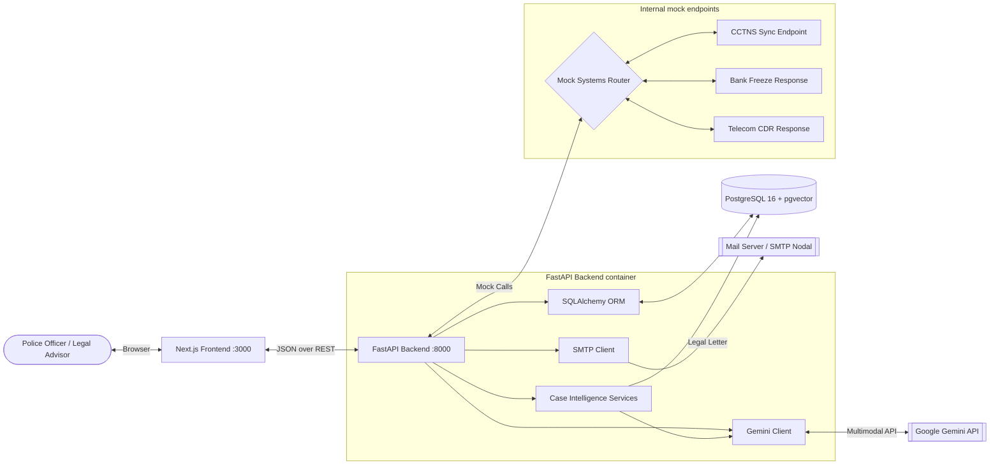
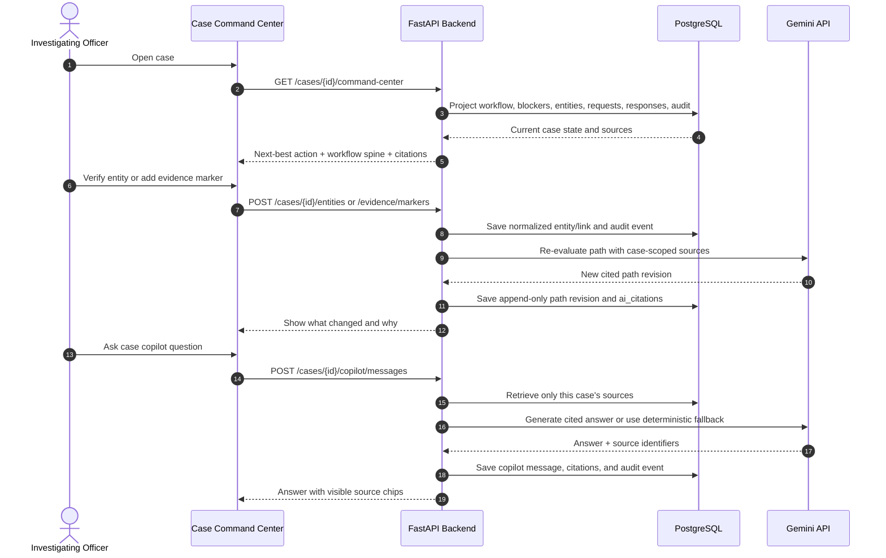
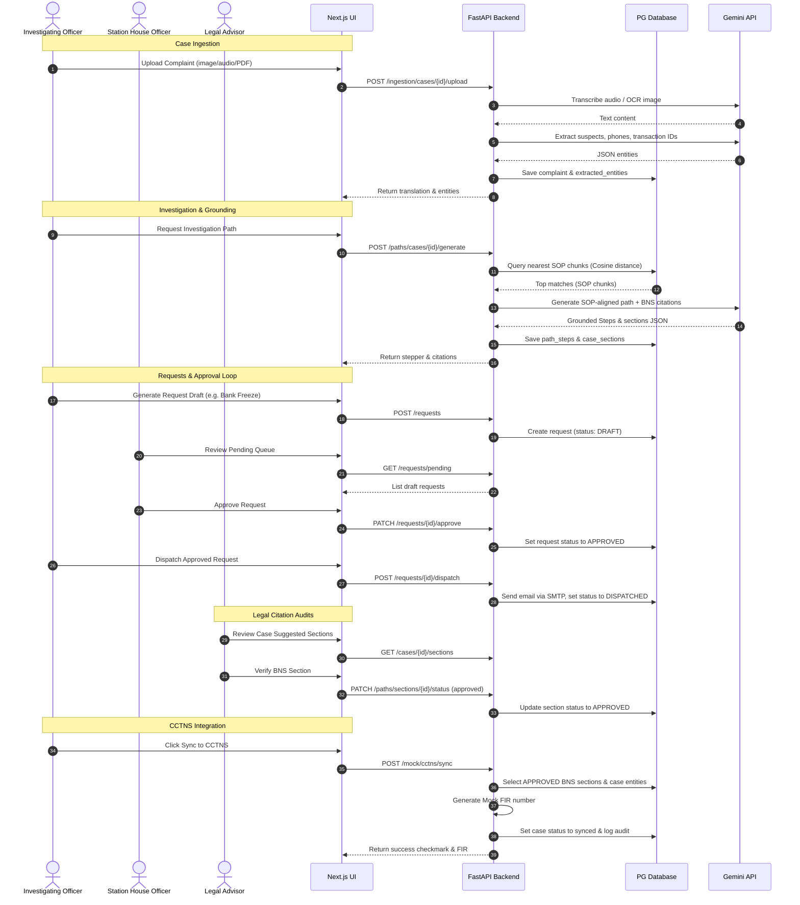

# System Architecture Diagram — Crime OS AI

## 🏗️ High-Level System Architecture

```mermaid
graph LR
    User([Police Officer / Legal Advisor]) <--> |Browser| FE[Next.js Frontend :3000]
    FE <--> |JSON over REST| BE[FastAPI Backend :8000]
    
    subgraph BE_CONTAINER [FastAPI Backend container]
        BE --> ORM[SQLAlchemy ORM]
        BE --> GC[Gemini Client]
        BE --> SMTP[SMTP Client]
        BE --> INT[Case Intelligence Services]
    end
    
    ORM <--> DB[(PostgreSQL 16 + pgvector)]
    GC <--> |Multimodal API| GEMINI[[Google Gemini API]]
    SMTP --> |Legal Letter| SMTP_SERVER[[Mail Server / SMTP Nodal]]
    BE <--> |Mock Calls| MOCKS{Mock Systems Router}

    INT --> DB
    INT --> GC
    
    subgraph MOCK_SYSTEMS [Internal mock endpoints]
        MOCKS <--> CCTNS[CCTNS Sync Endpoint]
        MOCKS <--> BANK[Bank Freeze Response]
        MOCKS <--> TEL[Telecom CDR Response]
    end
```

## Phase 8 Intelligence Loop

```mermaid
sequenceDiagram
    autonumber
    actor IO as Investigating Officer
    participant FE as Case Command Center
    participant BE as FastAPI Backend
    participant DB as PostgreSQL
    participant AI as Gemini API

    IO->>FE: Open case
    FE->>BE: GET /cases/{id}/command-center
    BE->>DB: Project workflow, blockers, entities, requests, responses, audit
    DB-->>BE: Current case state and sources
    BE-->>FE: Next-best action + workflow spine + citations

    IO->>FE: Verify entity or add evidence marker
    FE->>BE: POST /cases/{id}/entities or /evidence/markers
    BE->>DB: Save normalized entity/link and audit event
    BE->>AI: Re-evaluate path with case-scoped sources
    AI-->>BE: New cited path revision
    BE->>DB: Save append-only path revision and ai_citations
    BE-->>FE: Show what changed and why

    IO->>FE: Ask case copilot question
    FE->>BE: POST /cases/{id}/copilot/messages
    BE->>DB: Retrieve only this case's sources
    BE->>AI: Generate cited answer or use deterministic fallback
    AI-->>BE: Answer + source identifiers
    BE->>DB: Save copilot message, citations, and audit event
    BE-->>FE: Answer with visible source chips
```

---

## 🔁 Complete Golden-Path Data Sequence Diagram

```mermaid
sequenceDiagram
    autonumber
    actor IO as Investigating Officer
    actor SHO as Station House Officer
    actor LEGAL as Legal Advisor
    participant FE as Next.js UI
    participant BE as FastAPI Backend
    participant DB as PG Database
    participant AI as Gemini API
    
    Note over IO, FE: Case Ingestion
    IO->>FE: Upload Complaint (image/audio/PDF)
    FE->>BE: POST /ingestion/cases/{id}/upload
    BE->>AI: Transcribe audio / OCR image
    AI-->>BE: Text content
    BE->>AI: Extract suspects, phones, transaction IDs
    AI-->>BE: JSON entities
    BE->>DB: Save complaint & extracted_entities
    BE-->>FE: Return translation & entities
    
    Note over IO, FE: Investigation & Grounding
    IO->>FE: Request Investigation Path
    FE->>BE: POST /paths/cases/{id}/generate
    BE->>DB: Query nearest SOP chunks (Cosine distance)
    DB-->>BE: Top matches (SOP chunks)
    BE->>AI: Generate SOP-aligned path + BNS citations
    AI-->>BE: Grounded Steps & sections JSON
    BE->>DB: Save path_steps & case_sections
    BE-->>FE: Return stepper & citations
    
    Note over IO, FE: Requests & Approval Loop
    IO->>FE: Generate Request Draft (e.g. Bank Freeze)
    FE->>BE: POST /requests
    BE->>DB: Create request (status: DRAFT)
    SHO->>FE: Review Pending Queue
    FE->>BE: GET /requests/pending
    BE-->>FE: List draft requests
    SHO->>FE: Approve Request
    FE->>BE: PATCH /requests/{id}/approve
    BE->>DB: Set request status to APPROVED
    IO->>FE: Dispatch Approved Request
    FE->>BE: POST /requests/{id}/dispatch
    BE->>DB: Send email via SMTP, set status to DISPATCHED
    
    Note over LEGAL, FE: Legal Citation Audits
    LEGAL->>FE: Review Case Suggested Sections
    FE->>BE: GET /cases/{id}/sections
    LEGAL->>FE: Verify BNS Section
    FE->>BE: PATCH /paths/sections/{id}/status (approved)
    BE->>DB: Update section status to APPROVED
    
    Note over IO, FE: CCTNS Integration
    IO->>FE: Click Sync to CCTNS
    FE->>BE: POST /mock/cctns/sync
    BE->>DB: Select APPROVED BNS sections & case entities
    BE->>BE: Generate Mock FIR number
    BE->>DB: Set case status to synced & log audit
    BE-->>FE: Return success checkmark & FIR
```
