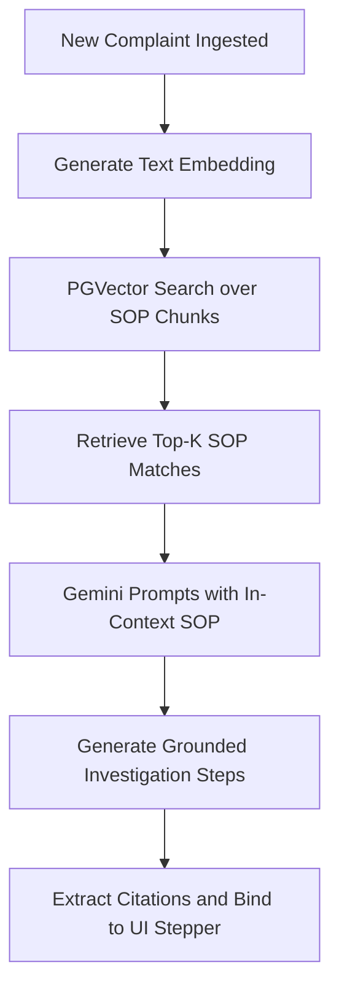

# SOP Grounding & RAG Architecture Note — Crime OS AI

## 📌 Context & Overview
Artificial intelligence in public safety and digital forensics must be **tamper-proof**, **grounded**, and **auditable**. Speculative or hallucinated investigation paths are unacceptable. 
**Crime OS AI** solves this by enforcing strict **Retrieval-Augmented Generation (RAG)** constraints over Standard Operating Procedures (SOPs) and statutory legal acts (BNS, BNSS, BSA).

---

## 🛠️ Retrieval-Augmented Generation (RAG) Flow

### 1. Vector Database & Storage
* **DB Store**: PostgreSQL 16 equipped with the `pgvector` extension.
* **Vector Dimension**: 768-dimensional float arrays.
* **Embedding Model**: Google Gemini `text-embedding-004` (invoked via `app/ai/gemini_client.py`).
* **Seeded Knowledge Base**:
  * SOP Documents (e.g. *Cyber Financial Fraud SOP*, *Mobile Theft SOP*, *Online Harassment SOP*).
  * SOP Chunks containing granular steps (intake, trace, recovery).

### 2. Querying & Semantic Search
When a case is created or analyzed:
1. The complaint text is translated to English (to keep semantic indexing language-agnostic).
2. The translated description is passed to the embedding API.
3. A cosine distance query (`embedding.cosine_distance(query_vector)`) is executed over `sop_chunks` inside `app/services/rag_service.py` to retrieve the relevant SOP rules.

---

## 🗺️ Investigation Path Generation & Citations
The retrieved SOP context chunks are passed directly into the Gemini prompt context window along with the complaint text.
* **System Constraints** (enforced in `INVESTIGATION_PATH_PROMPT`):
  * **Grounding Rule**: Every generated investigation step must match a specific procedural instruction from the SOP text.
  * **Citations Rule**: The step must explicitly cite the verbatim sentence from the SOP document inside its `sop_citation` property.
  * **Suggested Actions**: If the SOP dictates bank KYC/freeze, Platform Subscriber detail requests, or Telecom CDR tracing, the step binds the corresponding `suggested_action_type` parameter (`bank`, `platform`, or `telecom`).

In the UI, clicking **SOP Grounding** shows these verified citations so that the Investigating Officer can inspect the policy source behind the system recommendation.

---

## ⚖️ Legal Grounding (BNS/BNSS/BSA Citations)
Suggested legal citations are derived by running semantic search queries against the seeded legal code table:
* **Bharatiya Nyaya Sanhita (BNS)**: Excerpts for offense definitions (e.g. theft, cheating, harassment).
* **Bharatiya Nagarik Suraksha Sanhita (BNSS)**: Excerpts for procedural compliance (e.g. search, seizure, notice).
* **Bharatiya Sakshya Adhiniyam (BSA)**: Excerpts for digital evidence admissibility (e.g. certificate formatting, hash preservation).

### Human-in-the-Loop Audit Flow
While the AI recommends the citations, they are explicitly tagged as `"pending"` in `CaseSection` status:
1. An **Investigating Officer** views them as read-only recommendations.
2. A **Legal Advisor** logs in and views their dedicated review board.
3. The Legal Advisor reviews the citation and clicking **Verify Citation** or **Flag Inapplicable** patches the status to `approved` or `rejected` in the database.
4. The CCTNS synchronization routine only pushes `approved` legal sections to the national police records database.
