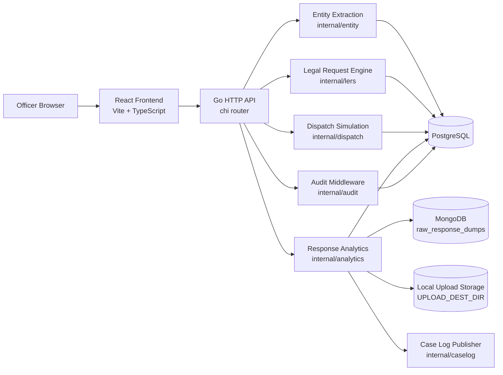

# Architecture

CrimeOS Digital Footprint is a modular investigation workflow for extracting digital entities from complaints, drafting legal enforcement requests, tracking dispatch, ingesting provider responses, and surfacing intelligence flags.

## System Overview

## Frontend

The frontend lives in `frontend/` and is a React 19 + TypeScript app built with Vite.

Primary pages:

| Route | Page | Responsibility |
| --- | --- | --- |
| `/cases/:caseId/intake` | `IntakeReview` | Paste complaint text, extract entities, confirm or reject entities. |
| `/cases/:caseId/lers` | `LersConsole` | Draft and approve legal requests from confirmed entities. |
| `/cases/:caseId/dispatch` | `DispatchTracker` | Track request status, dispatch queued requests, show timeline progress. |
| `/cases/:caseId/analytics` | `AnalyticsDashboard` | Upload provider responses, view parsed records, review intelligence flags. |

Shared frontend areas:

| Directory | Responsibility |
| --- | --- |
| `src/api/` | Typed wrappers for backend REST endpoints. |
| `src/types/` | TypeScript API and domain types. |
| `src/components/` | Reusable UI widgets such as entity tables, LERS cards, timelines, upload forms, record tables, and flag panels. |
| `src/context/` | Lightweight case/auth context used by the hackathon UI. |
| `e2e/` | Playwright full-pipeline browser test. |

## Backend

The backend lives in `backend/` and is a Go modular monolith. It uses `chi` for routing, PostgreSQL for relational data, MongoDB for raw response metadata, and local filesystem storage for uploaded files.

Important packages:

| Package | Responsibility |
| --- | --- |
| `internal/entity` | Extract and normalize IPs, emails, phone numbers, UPI IDs, social handles, and related digital identifiers. |
| `internal/lers` | Manage service providers, render LERS templates, create and approve legal requests. |
| `internal/dispatch` | Queue and simulate dispatch, record dispatch events, sweep overdue requests. |
| `internal/analytics` | Save uploads, mirror dump metadata to MongoDB, parse records, run heuristics, write normalized records and flags. |
| `internal/audit` | Append audit entries for mutating API operations. |
| `internal/caselog` | Publish derived intelligence events to the case log outbox. |
| `internal/handler` | HTTP handlers for the API surface. |
| `internal/db` | PostgreSQL, MongoDB, and migration setup. |
| `internal/middleware` | Logging, recovery, and audit wrappers. |

## Runtime Workers

The API process starts three background workers:

| Worker | Source | Purpose |
| --- | --- | --- |
| Dispatch worker | `dispatch.RunWorker` | Consumes dispatch queue items and transitions legal requests through simulated sent/acknowledged events. |
| Overdue sweeper | `dispatch.RunOverdueSweeper` | Periodically marks stale requests as overdue. |
| Parse worker | `analytics.RunParseWorker` | Parses uploaded response dumps and writes normalized records plus intelligence flags. |

## Storage Model

| Store | Used For |
| --- | --- |
| PostgreSQL | Digital entities, service providers, legal requests, dispatch events, normalized records, intelligence flags, audit log, case log outbox. |
| MongoDB | Raw response dump metadata and parse status documents. |
| Local filesystem | Uploaded response files under `UPLOAD_DEST_DIR` or `backend/uploads` by default. |

## Request Lifecycle

1. Officer opens a case in the frontend.
2. Complaint text is submitted to entity extraction.
3. Extracted entities are reviewed and confirmed by the officer.
4. Confirmed entities are attached to a legal request for a chosen provider/template.
5. The request is approved, queued, dispatched, acknowledged, and tracked.
6. Provider response files are uploaded against eligible dispatched requests.
7. The parser normalizes records into PostgreSQL.
8. Heuristics create intelligence flags and case log events.

## Security And Audit Notes

- Mutating backend routes are wrapped by audit middleware where implemented.
- The current frontend auth context is a local hackathon stub, not production authentication.
- Uploaded files are limited to 25 MB and restricted to `.csv`, `.xlsx`, and `.pdf` on the client; backend storage enforces the 25 MB limit.
- Legal request dispatch is simulated, not connected to a real SMTP or provider gateway.

